<p align="center">
  <a href="https://open.mcd.cn/mcp" target="_blank">
    
  </a>
</p>

# 介绍

## 本次活动是什么？

本次活动是麦当劳程序员节创意开发大赛！

我们面向中国大陆地区的开发者发起邀请：基于麦当劳 MCP 能力，开发属于自己的 AI Skill，让创意真正解决现实问题，还有机会赢取程序员节专属好礼。

## 你可以开发什么？

减脂点餐助手、麦门省钱助手、麦麦活动推荐助手等。麦当劳 MCP 提供基础能力，你可以创造更多使用场景，开发兼具创意与实用价值的 Skill。

## 赛事时间

以下时间均为北京时间：

- （1）报名及排名：2026年10月9日00:00至10月25日23:59
- （2）作品评审：2026年10月26日至10月30日
- （3）获奖信息提交：2026年11月1日至11月14日
- （4）奖励发放：提交收货信息后约2周内

排名规则、赛事奖励及注意事项等，请参见`activityGuidelines.md`。

---

# 参与方式

## 注册 MCP

- 第一步：点击右上角【登录】按钮

  <div class="img">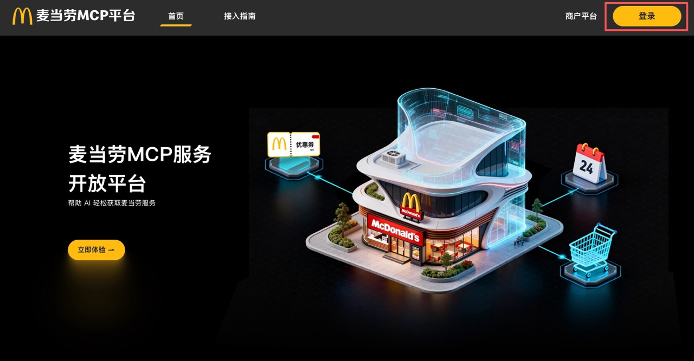</div>

- 第二步：跳转至登录页面，使用手机号完成验证登录

  <div class="img">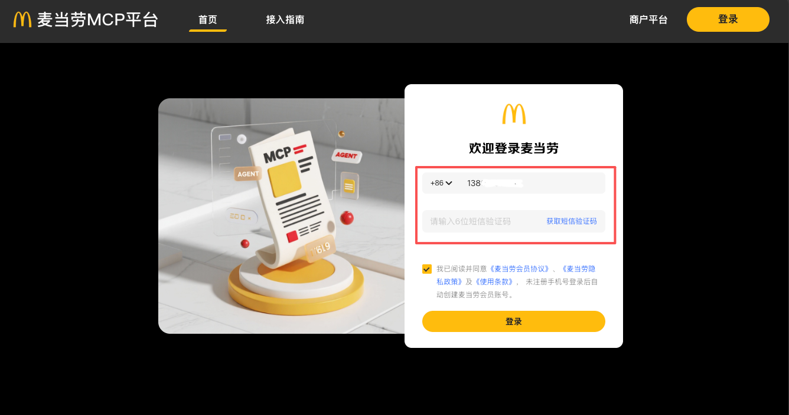</div>

  登录成功后将返回首页，右上角的“登录”按钮将变为“控制台”

  <div class="img">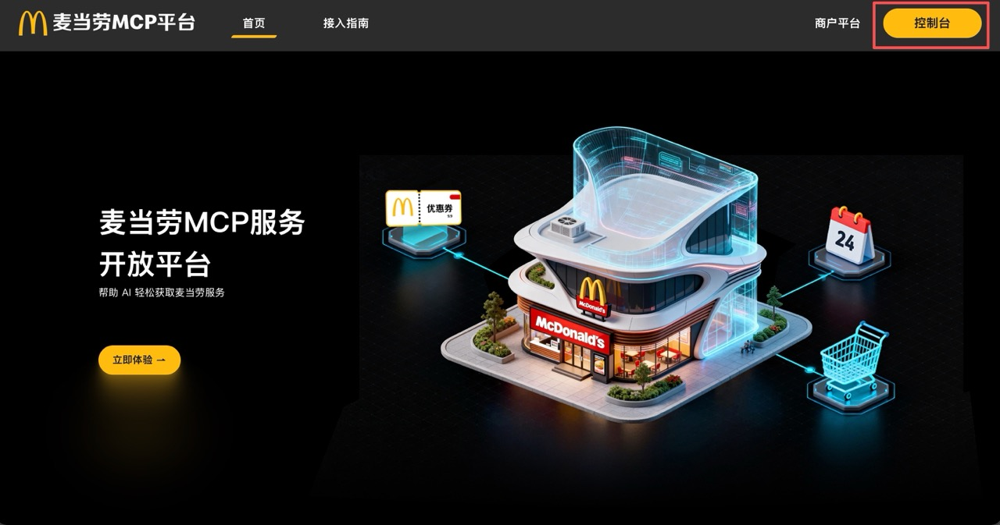</div>

- 第三步：申请 MCP Token

  点击右上角“控制台”，打开控制台弹窗。

  点击“激活”按钮，申请 MCP Token。

  <div class="img"></div>

- 第四步：阅读并同意服务协议

  <div class="img">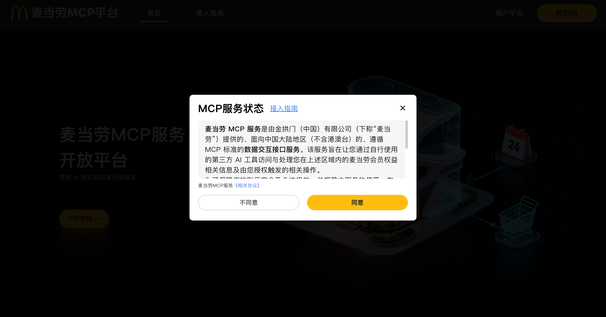</div>

- 第五步：MCP Token 申请成功后，可一键复制

  <div class="img">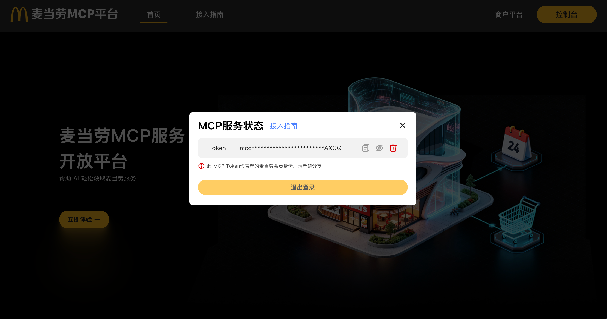</div>

## 开发 Skill

参与者可以基于麦当劳现有的 MCP 能力，结合创意场景，开发具有创意或实用价值的 Skill 项目。为确保项目能够顺利报名，项目仓库应包含以下内容：

| 序号 | 文件名称 | 说明 | 是否必须 |
|:---:|---|---|---|
| 1 | README.md | 项目介绍、安装方法、使用示例和目标用户 | 必须，文件名不可改动 |
| 2 | CONTEST_DECLARATION.md | 参赛声明，包括原创性、合规性和敏感信息声明，防止项目被直接盗用 | 必须，文件名不可改动 |
| 3 | MCP_INTEGRATION.md | 说明实际使用的麦当劳 MCP Server、Tool、调用流程和业务价值 | 必须，文件名不可改动 |
| 4 | 源代码 | 项目主体代码或可运行内容 | 必须，形式不限 |
| 5 | workbuddy.md | 使用 WorkBuddy 开发时的对话上下文，用于核验是否符合联动活动奖励条件，可自行导出 | 非必须；参加 WorkBuddy 专项奖励时必须提交，文件名不可改动 |

## 将项目上传至 GitHub 并设为公开

> 后续文档截图均为示例。

<div class="img">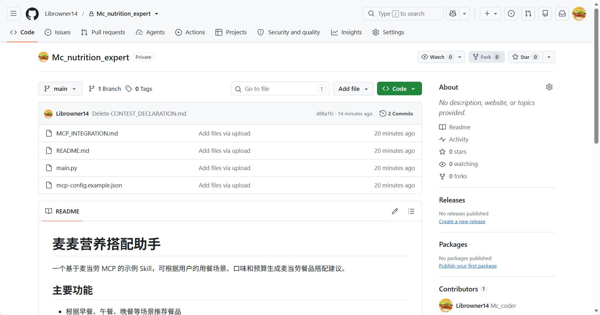</div>

## 通过 Issue 报名

按照标准格式，在活动项目下发布 Issue。格式如下：

```text
Issue 标题：自定义报名标题
Issue 正文：
【参赛申请】
项目名称：{项目名称}
项目地址：{项目 GitHub 仓库地址}
项目简介：{项目简介}
```

<div class="img">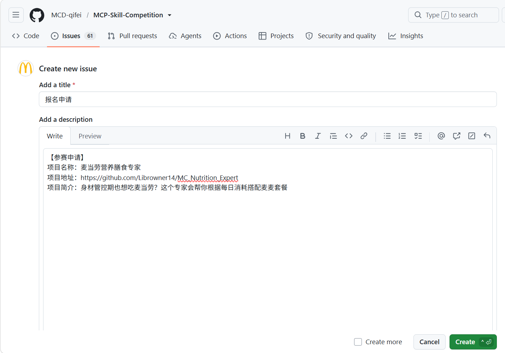</div>

### （1）报名条件

- 项目中包含规定的文件，且指定文件名符合要求
- 按照标准格式发布报名 Issue
- GitHub 项目为公开可访问的 Public 仓库
- 项目名称及项目内容不包含违法违规或敏感内容
- 项目创建时间为2025年12月25日00:00至2026年10月25日23:59

> 关于项目创建时间的说明：2025年12月25日是麦当劳 MCP 正式上线的日期。我们欢迎已有技术沉淀的优秀项目参与本次比赛，为广大开发者提供更多交流与学习的机会。

### （2）报名成功

报名成功后，系统将在报名 Issue 下回复成功通知。

<div class="img">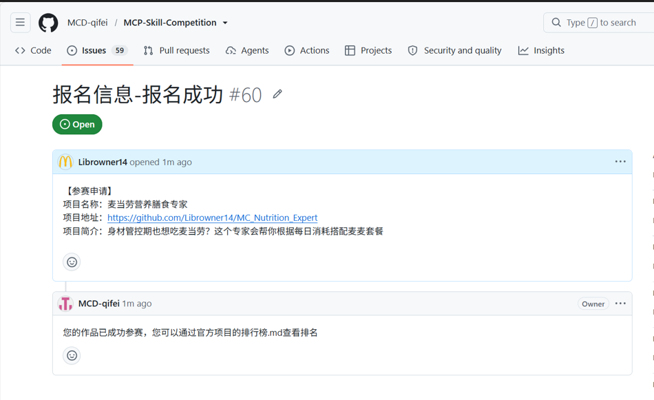</div>

### （3）报名失败后重新报名

如果因不满足条件导致报名失败，系统也会在报名 Issue 下回复失败原因。完成相应修改后，你可以重新提交 Issue。

<div class="img">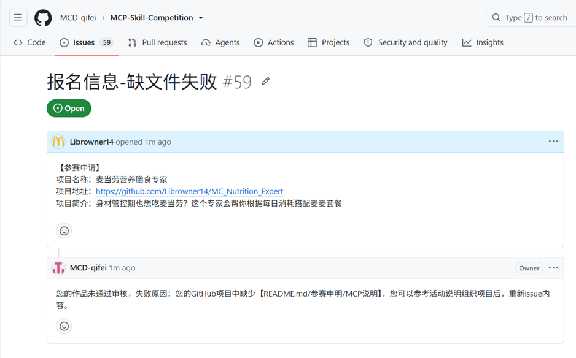</div>

## 排行榜更新

活动开始后，麦当劳将定时采集报名成功项目的公开 Star 数据。Star 数大于0的项目将按照排名规则进入排行榜，参赛者可在活动主项目的`RANKING.md`文件中查看项目排名。

<div class="img">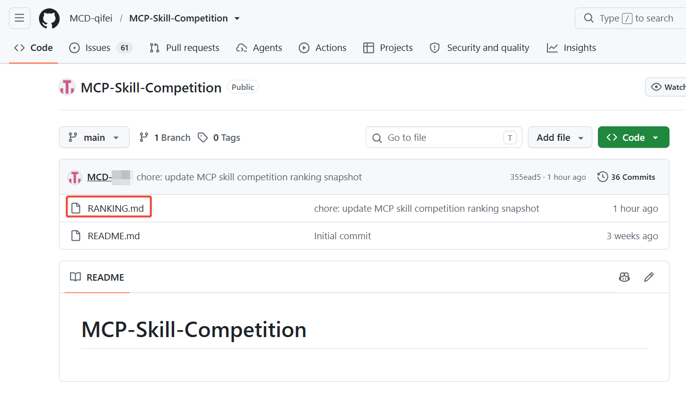</div>

<div class="img">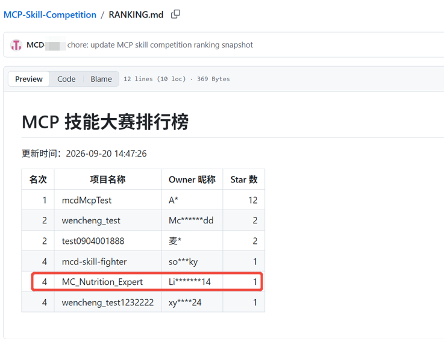</div>

## 定榜及人工审核

活动于2026年10月25日23:59结束，并以2026年10月26日00:00采集的排行榜数据作为最终排名依据。原则上，排行榜前100个项目进入获奖范围；如第100个项目与后续项目的Star数相同，则所有同分项目均进入排行榜。

我们将对获奖项目进行人工审核，审核内容如下：

| 序号 | 审核内容 |
|:---:|---|
| 1 | 项目包含实际源代码或可运行内容 |
| 2 | 项目真实使用了麦当劳 MCP |
| 3 | 项目内容不包含违法违规、色情、暴力、赌博、歧视等内容 |
| 4 | 项目内容不存在贬低麦当劳或与其他品牌进行不当比较的情况 |
| 5 | 参与者的 GitHub 主页不包含违法违规、色情、暴力、赌博、歧视等内容 |

如果项目未通过上述人工审核，麦当劳有权取消其参赛资格或获奖资格，并不予发放相应奖励。

## 获奖信息提交

### （1）邮箱获取

麦当劳将尝试获取项目 Owner 的 GitHub 注册邮箱，用于发送获奖通知。若项目 Owner 已公开注册邮箱，麦当劳将直接读取公开邮箱；若注册邮箱未公开，麦当劳将通过 GitHub OAuth 授权机制发起授权申请，经项目 Owner 同意后读取其注册邮箱。

<div class="img">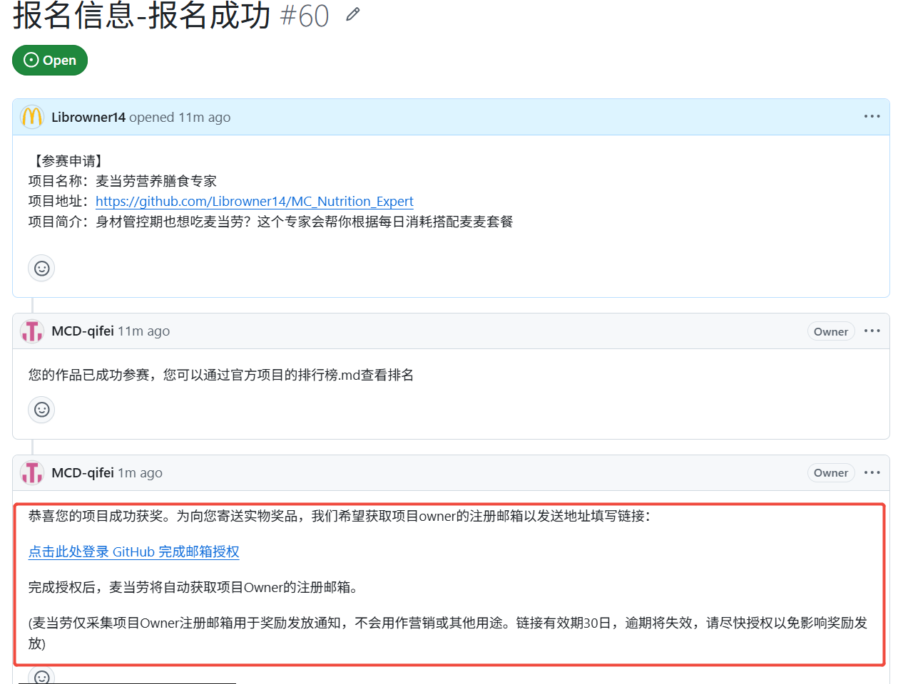</div>

<div class="img">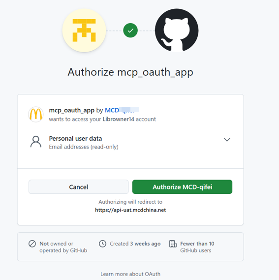</div>

### （2）问卷填写

获取邮箱后，我们将向该邮箱发送获奖通知及领奖信息收集问卷。问卷信息将用于发放实物奖品和电子奖励，请获奖者及时填写。

### （3）电子奖励兑换

前三名电子兑换券奖励：

- 第1名：巨无霸汉堡50次免费兑换券1张
- 第2名：巨无霸汉堡30次免费兑换券1张
- 第3名：巨无霸汉堡20次免费兑换券1张

WorkBuddy积分奖励：

- 进入排行榜且真实使用腾讯 WorkBuddy，并提交`workbuddy.md`的项目，可获得WorkBuddy积分奖励
- 前3名每人可获得10,240积分
- 其他符合条件的上榜项目每人可获得3,000积分
